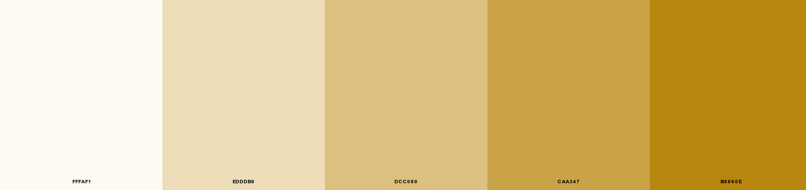

# Assets

## Color schema

The White-Gold Gradient Color Scheme palette has 5 colors which are **Floral White** (#FFFAF1), **Dutch White** (#EDDDB8), **Burlywood** (#DCC080), **Aztec Gold** (#CAA347) and **Dark Goldenrod** (#B8860E).

This color combination was created by user Manish from [schemacolor.com](https://www.schemecolor.com/white-gold-gradient.php#download). 

## Icons

Icons such as *facebook icon* come from [fontawesome](https://fontawesome.com/search?q=bars&s=solid%2Cbrands) or [material icons](https://mui.com/material-ui/material-icons/).
